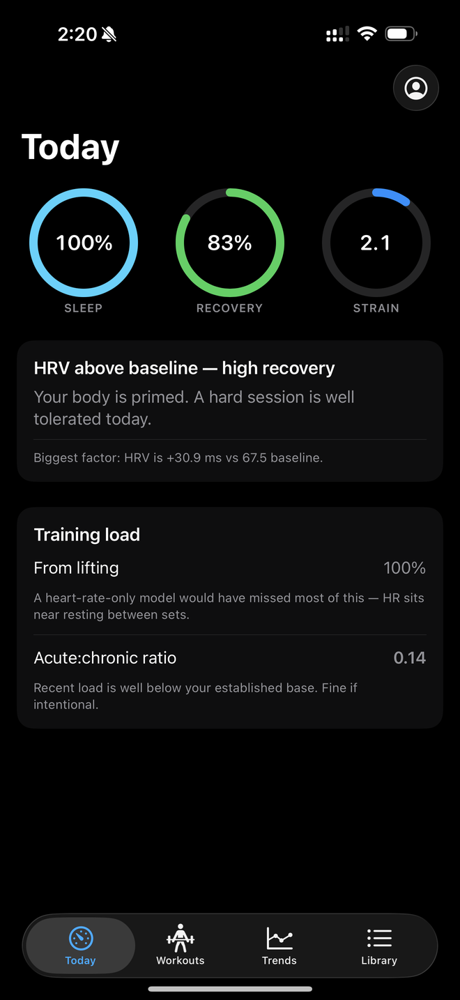
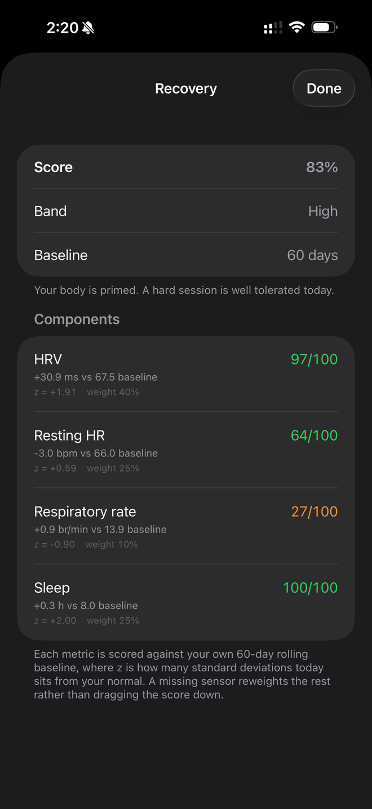
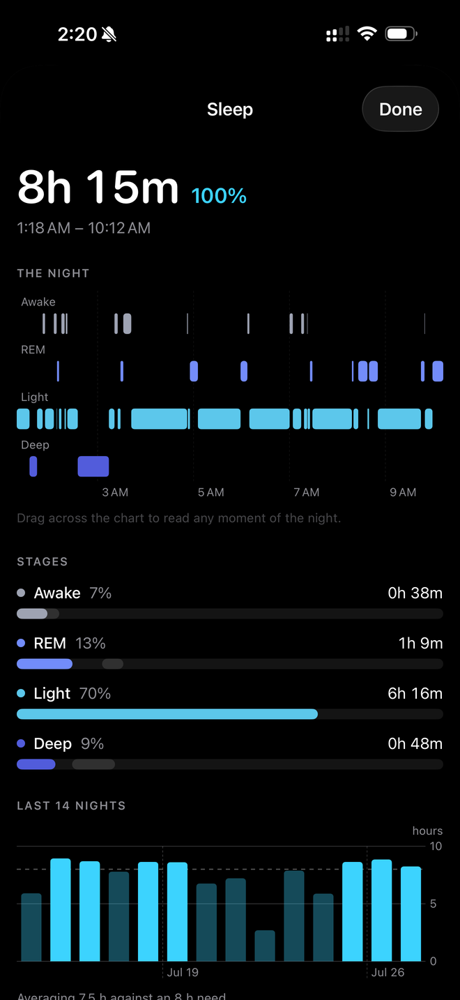
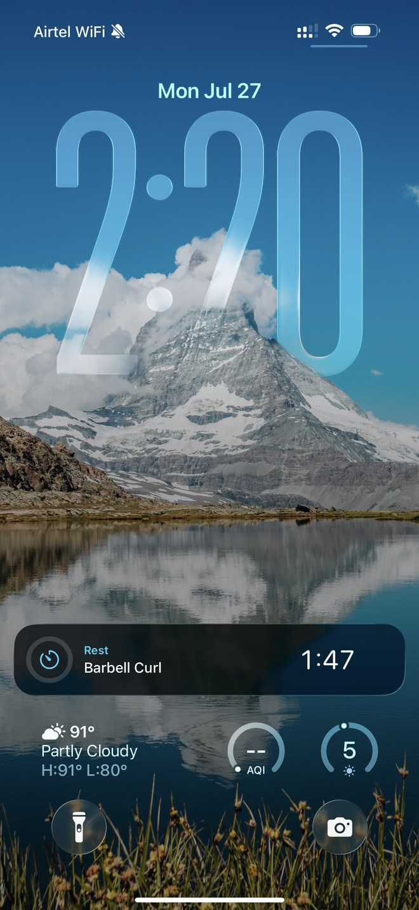

# Loadstar

An iOS training app that reads Apple Watch data and tells you what your lifting is
actually doing to you.

I built it because I own an Apple Watch Ultra that collects basically everything a
Whoop band does, and the Health app presents all of it as a pile of disconnected
charts. Meanwhile my lifting log lived in Apple Notes as lines like `Squats 70kgs
/ 6 / 6 / 6`, typed by hand, with no connection to any of that data.

There are apps that fill part of this gap. Athlytic, Bevel, Training Today. I used
them and hit the same two problems every time.

**They undercount lifting.** Strain in those apps comes almost entirely from heart
rate, which works fine for running and badly for resistance training, where your
heart rate drops back to near-resting during the two minutes between sets. A heavy
squat session can register as roughly a walk.

**They don't show their work.** You get a recovery score of 65% and no way to find
out why. If you want to know whether that came from bad sleep or an elevated resting
heart rate, tough.

So Loadstar counts mechanical work alongside cardiovascular work, and every score in
the app expands into the arithmetic behind it.

<p align="center">
  
  
  
  
</p>

<p align="center">
  <em>The dashboard · the same recovery score opened up · the night, stage by stage · rest timer on the Lock Screen</em>
</p>

---

## What it does right now

**Recovery scoring.** Each morning it scores HRV, resting heart rate, respiratory
rate, and sleep against your own 60-day rolling baseline, weights them, and gives you
a number out of 100. Tap the ring and you get the components: `HRV 98 ms vs 67.5 ms
baseline, z = +1.91, weighted 40%`. If a sensor is missing that day, its weight gets
redistributed across the others instead of quietly dragging the score down.

**Strain that counts lifting.** Two channels, summed. Cardiovascular load is Banister
TRIMP computed from the heart rate of every workout your watch recorded. Mechanical
load is volume from your logged sets, normalised to bodyweight. The result gets
compressed onto a 0–21 scale. On a leg day the app will tell you 90%+ of your strain
came from lifting, which is exactly the number a heart-rate-only model throws away.

**Sleep.** A hypnogram of the actual night, banded by stage across real clock time,
which you can drag across to read any moment. Plus stage percentages against typical
ranges and a 14-night history. Seeing *when* your deep sleep happened turns out to be
more informative than the total — it normally front-loads, and a night where it
doesn't looks very different at the same number.

**Lifting log.** Exercise library where each movement carries its own configuration:
target rep range, weight increment, rest length, whether it's loaded per side, bar
weight. Log a set and the next one is pre-filled with what the progression engine
expects. It runs double progression, so it'll tell you `3 × 8 @ 60 kg — hit 3 × 10 to
earn 65`.

**Rest timer.** Starts automatically when you log a working set. Runs as a Live
Activity, so the countdown sits in the Dynamic Island and on the Lock Screen while
your phone is in your pocket.

**Personal records.** Four kinds, because "PR" means different things depending on the
day: estimated 1RM, heaviest weight, most reps at a given weight, biggest session
volume. That third one matters. Going 8 → 9 reps at the same weight is real progress
that a weight-only definition ignores completely.

**Acute:chronic workload ratio.** Seven-day load over twenty-eight-day load, the
standard sports-science ramp metric. Roughly 0.8–1.3 is the sustainable band. None of
the consumer apps expose this and it's the single most useful number for not getting
hurt.

---

## The math

Everything below lives in pure Swift files with no UIKit, no SwiftData and no
HealthKit imports, so it can be unit tested without a device — and so it drops into a
watchOS target unchanged when I get there.

**Recovery**, per metric, against a 60-day rolling baseline:

```
z = (today − μ) / σ
contribution = clamp(50 + 25z, 0...100)
```

±2σ hits the rails, since two standard deviations covers about 95% of days. Sleep is
deliberately *not* z-scored — it's measured against an 8-hour target, because scoring
it against your own average would quietly reward you for being reliably underslept.

**Cardiovascular load**, Banister TRIMP:

```
TRIMP = duration(min) × HRr × 0.64 × e^(b × HRr)
HRr   = (HRavg − HRrest) / (HRmax − HRrest)
b     = 1.92 (male) / 1.67 (female)
```

The exponential is the whole point. Physiological cost rises disproportionately with
intensity, so ten minutes hard should be worth much more than twenty minutes easy,
and `minutes × average HR` gets that wrong.

**Mechanical load** normalises volume to bodyweight, because 10,000 kg of work is a
much bigger stimulus for a 61 kg lifter than a 100 kg one.

**Estimated 1RM** uses Epley, `weight × (1 + reps/30)`, and returns nothing above 12
reps. The formula drifts high on long sets and a bad estimate is worse than no
estimate when it's feeding a progression chart.

### Where I'm guessing

Worth being straight about this: the constants that convert mechanical load into
TRIMP-equivalent units, and the saturation constant for the 0–21 strain scale, are
**chosen, not derived**. There is no published figure for how much TRIMP a set of
squats is worth. I've isolated all three in one place with names and comments so they
can be recalibrated once I have enough real history to check them against. Dressing
them up as science would be worse than admitting it.

---

## Some decisions that turned out to matter

**Weights are stored with their unit.** My old log switched from pounds to kilograms
partway through, because I spent a summer training in Copenhagen. My squat went from
130 lb to 65 kg over that period. Store those as bare numbers and it looks like my
legs fell off; convert properly and it's a 10% gain. Every calculation normalises to
kilograms; every display shows the number as I originally wrote it, because a
prescription that doesn't match the plate in front of you is useless.

**Sets know whether they're per side, and what the bar weighs.** `25 kg` on a squat
means 25 per side plus a 20 kg bar, so 70 kg total. Guessing wrong here is a ~3×
error in every downstream number.

**HRV comes from overnight samples only.** My first version averaged across the whole
calendar day and produced z-scores above +3, which is not a physiological signal, it's
measurement noise. Apple samples HRV opportunistically during the day and those
readings move with posture, caffeine, and whatever you're doing at that moment.
Overnight readings are taken under consistent conditions, which is the only reason
comparing them night to night means anything.

**Sleep belongs to the morning it ended.** Obvious in hindsight. My first version
attributed each night to the day it *started*, which meant today's row was always
empty because tonight hasn't happened yet.

**The rest timer stores an end date, not a counter.** A ticking counter stops when
iOS suspends the app and drifts when it resumes. An end date is correct whenever
anything reads it, which is why the Live Activity counts down accurately with the app
closed — the system renders it, nothing gets pushed.

---

## What I'm working on

The thing I actually want, and haven't built yet, is for the app to tell me what to
do rather than just what happened.

- **Lagging lift detection.** Rank every exercise by its e1RM trend so I can see at a
  glance what's moving and what's been flat for a month. Most of the maths is already
  there, it's just never compared across the library.
- **Muscle balance and frequency.** Weekly hard sets per muscle group against the
  productive range, plus push:pull, upper:lower and quad:hamstring ratios. I want to
  count hard sets rather than kilograms, since that's how lifters and the hypertrophy
  literature actually think, and tonnage is dominated by leg press anyway.
- **A daily training recommendation** — train hard, train easy, or rest — composed
  from recovery, acute:chronic ratio, muscle freshness and how many days a week I'm
  aiming to train. It has to show its reasoning like everything else does. HRV-guided
  training has real literature behind it but the effect sizes are modest, and a
  suggestion that pretends to be an oracle would be dishonest.
- **A daily journal** for soreness, stress, caffeine and alcohol, and eventually
  correlating those against next-day HRV. That's the one I'm most curious about,
  because it produces a finding about *me* rather than a score.
- **An Apple Watch app**, so I can log sets at the rack instead of picking up my
  phone between every set. The engines are already framework-free specifically so
  they can move over unchanged.
- **Editing exercise defaults.** Right now you can only set some of them at creation
  and can't change them afterwards, which is less a missing feature than a bug.
- **Tests.** The engines are pure functions and there's no excuse.

---

## Built with

Swift 6, SwiftUI, SwiftData, HealthKit, Swift Charts, ActivityKit, WidgetKit.
No third-party dependencies.

Requires iOS 26 and a real device — HealthKit returns nothing in the Simulator, so
there's no way to develop this against fake data.

```
Loadstar/
  Models.swift              SwiftData layer, unit and loading normalisation
  RecoveryEngine.swift      z-scores against rolling baselines
  StrainEngine.swift        TRIMP, mechanical load, ACWR, monotony
  ProgressionEngine.swift   double progression, e1RM series, stall detection
  PersonalRecordEngine.swift
  HealthKitService.swift    ingestion, one normalised row per day
  RestTimer.swift           end-date based, drives the Live Activity
  ...views
RestTimerWidget/            Live Activity presentation
```

The four `*Engine.swift` files are the interesting part and import nothing but
`Foundation`.

---

Built by [Rameez Rahaman](https://github.com/rrameez99). It's a personal project, so
the roadmap is entirely "things that annoy me about my own training."
